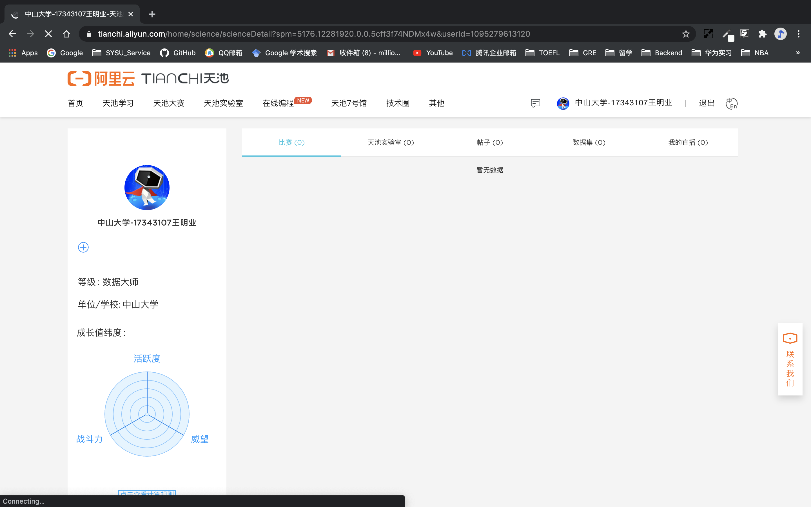

# 第一周周报

- [第一周周报](#第一周周报)
  - [一、 理论学习](#一-理论学习)
    - [1. 课程目标](#1-课程目标)
    - [2. 大数据的定义](#2-大数据的定义)
    - [3. 大数据的应用](#3-大数据的应用)
  - [二、 实践](#二-实践)
    - [1. 天池账户注册](#1-天池账户注册)

## 一、 理论学习

### 1. 课程目标

- 掌握数据挖掘领域的常用挖掘工具与算法实现
- 通过参加数据挖掘比赛，基于真实的业界数据来建模及设计出独立思考的方案

两个数据挖掘比赛：
1. [天池大数据比赛学习赛贷款违约预测](https://tianchi.aliyun.com/competition/entrance/531830/introduction)（案例教学、平时作业评分）
2. 学期中发布。

### 2. 大数据的定义

大数据 -> 获得片面数据无法获得的信息

大数据源于信息技术的不断廉价化与互联网及其延伸所带来的无处不在的信息技术应用，四个驱动：
1. 摩尔定律驱动的指数增长模式 （**硬件**）
2. 技术低成本化驱动的万物数字化 （**技术**）
3. 宽带移动泛在互联驱动的人机物广泛联接 （**联接**）
4. 云计算模式驱动的数据大规模汇聚 （**平台**）

**技术能力视角**定义大数据：大数据指的是规模超过现有数据库工具获取、存储、管理和分析能力的数据集，并同时强调并不是超过某个特定数量级的数据集才是大数据。

**大数据内涵视角**定义大数据：大数据是具备海量、高速、多样、可变等特征的多维数据集，需要通过可伸缩的体系结构实现高效的存储、处理和分析。                     

### 3. 大数据的应用

三个层次：
- **描述：**关注到底当前发生了什么，把发展的态势描述出来，呈现发展的历程
- **预测：**在分析的基础之上，预测它未来可能会发生什么，呈现事物发展的趋势。比如流感预测，奥斯卡预测等
- **指导性：**指导性的就当前的态势，如果你做一个动作，会产生什么后果，便于根据当前态势做出决策，不仅预测未来，而是做一个动作以后，做一个决策以后，会不会影响未来的结果

## 二、 实践

### 1. 天池账户注册

