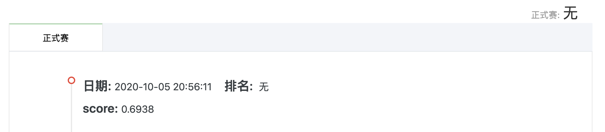

# 第二周周报

> 本次实践完整代码见[../code/competition_1_tianchi/week_2_svm_logistic](../code/competition_1_tianchi/week_2_svm_logistic)

- [第二周周报](#第二周周报)
  - [一、特征工程](#一特征工程)
    - [1. 数据选择](#1-数据选择)
    - [2. 缺失值处理](#2-缺失值处理)
  - [二、模型选择](#二模型选择)
    - [1. SVM](#1-svm)
    - [2. Logistic Regression](#2-logistic-regression)

## 一、特征工程

### 1. 数据选择

通过观察发现数据一部分为数值型特征，另一部分为非数值型特征。非数值型特征需要经过处理（如one-hot编码）后才能作为输入数据用以训练。本次实践取所有数值型特征作为输入数据，不使用非数值型特征。

**注意:**在筛选出所有数据类型为数值的字段后，要去掉标签字段和 `id` 字段。因为标签字段作为训练集输出要与输入数据区分开；`id` 字段不能作为量化指标参与训练。

```python
#所有数值字段
numerical_fea = list(data_train.select_dtypes(exclude=['object']).columns)
#所有非数值字段
category_fea = list(filter(lambda x: x not in numerical_fea,list(data_train.columns)))
#标签字段为：isDefault
label = 'isDefault'
#去除数值字段中的标签字段
numerical_fea.remove(label)
#去除数值字段中的id字段
numerical_fea.remove("id")
```

### 2. 缺失值处理

```python
#按照中位数填充数值型特征
data_train[numerical_fea] = data_train[numerical_fea].fillna(data_train[numerical_fea].median())
data_test_a[numerical_fea] = data_test_a[numerical_fea].fillna(data_train[numerical_fea].median())
#按照众数填充类别型特征
data_train[category_fea] = data_train[category_fea].fillna(data_train[category_fea].mode())
data_test_a[category_fea] = data_test_a[category_fea].fillna(data_train[category_fea].mode())
```

## 二、模型选择

### 1. SVM

本次实践起初采用SVM模型进行训练，训练时间很长，若使用完整80万条训练数据，数小时都无法完成训练与预测。选取前3万条训练数据训练模型，训练时间数分钟，但模型预测效果很不好。故改用其他模型再做尝试。

[本次实践SVM代码](../code/competition_1_tianchi/week_2_svm_logistic/svm.py)

### 2. Logistic Regression

发现SVM效果不好后，才用逻辑回归模型进行训练。使用完整80万条训练数据，在数分钟内能完成训练与预测。模型预测效果较SVM提升很多。

本次成绩：



[本次实践逻辑回归代码](../code/competition_1_tianchi/week_2_svm_logistic/logistic.py)（即本博客开头给出的链接）


