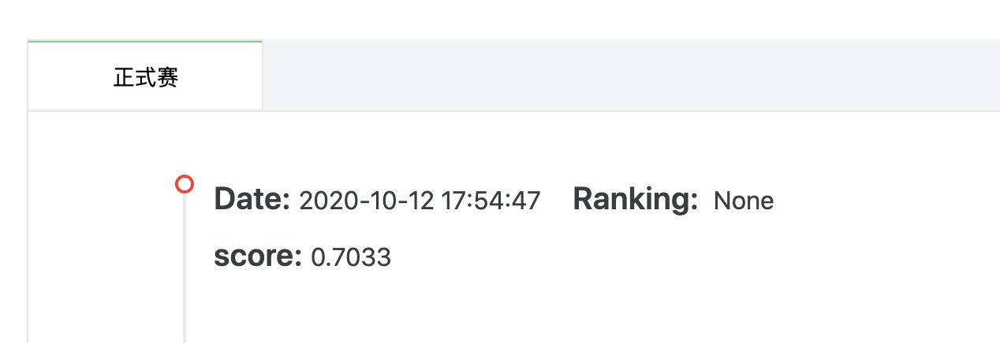

# 第三周周报

> 本次实践完整代码见[../code/competition_1_tianchi/week_3_non_numerical](../code/competition_1_tianchi/week_3_non_numerical)

- [第三周周报](#第三周周报)
  - [一、特征工程](#一特征工程)
    - [1. `grade` 数值化](#1-grade-数值化)
    - [2. `subGrade` 数值化](#2-subgrade-数值化)
    - [3. `employmentLength` 数值化](#3-employmentlength-数值化)
    - [4. `issueDate` 数值化](#4-issuedate-数值化)
    - [5. `earliesCreditLine` 数值化](#5-earliescreditline-数值化)
  - [二、模型选择](#二模型选择)
    - [1. Logistic Regression](#1-logistic-regression)

## 一、特征工程

在第二周的特征工程中，进行了**数据选择**和**缺失值处理**。详见[第二周周报](./week_report_2.md)。

本周特征工程，对非数值数据进行数值化处理，以便加入训练。具体的数值化方法均为自己所想，可能有不完善之处。

### 1. `grade` 数值化

```python
# grade 映射
# 检视grade下有哪些值，放入列表并排序
distinct_grade_value = list(data_train["grade"].unique())
distinct_grade_value.sort()
# 构建grade到数值的映射，grade为A的数值为1，往后依次递增1
grade_number_map = {}
for i in range(0, len(distinct_grade_value)):
    grade_number_map[distinct_grade_value[i]] = i + 1

# 创建使grade映射到数值的函数
def grade_map_to_number(grade_column):
    return grade_number_map[grade_column]

# 将grade映射到数值的函数应用到原数据的grade列上，并将结果储存在新列gradeNumber中
grade_number_column_name = "gradeNumber"
data_train[grade_number_column_name] = data_train["grade"].apply(grade_map_to_number)
data_test_a[grade_number_column_name] = data_test_a["grade"].apply(grade_map_to_number)
# grade_number_column_name是数值型字段，将grade_number_column_name加入numerical_fea
numerical_fea.append(grade_number_column_name)

```

### 2. `subGrade` 数值化

```python
# subGrade 映射
# 检视subGrade下有哪些值，放入列表并排序
distinct_subGrade_value = list(data_train["subGrade"].unique())
distinct_subGrade_value.sort()

# subGrade到数值的映射：subGrade的数值为 grade字母对应的数值 + 后跟数字的值
# 创建使subGrade映射到数值的函数
def subGrade_map_to_number(subGrade_column):
    return grade_number_map[subGrade_column[0]] + int(subGrade_column[1])

# 将subGrade映射到数值的函数应用到原数据的subGrade列上，并将结果储存在新列subGradeNumber中
subGrade_number_column_name = "subGradeNumber"
data_train[subGrade_number_column_name] = data_train["subGrade"].apply(subGrade_map_to_number)
data_test_a[subGrade_number_column_name] = data_test_a["subGrade"].apply(subGrade_map_to_number)
# subGrade_number_column_name是数值型字段，将subGrade_number_column_name加入numerical_fea
numerical_fea.append(subGrade_number_column_name)

```

### 3. `employmentLength` 数值化

```python

# employmentLength映射
# 检视employmentLength下有哪些值，放入列表并排序
distinct_employmentLength_value = list(data_train["employmentLength"].unique())
#distinct_employmentLength_value.sort()
#print(distinct_employmentLength_value)

# employmentLength到数值的映射：若employmentLength为n years，其数值为n。10+ years为10，< 1 year为0。
# 创建使employmentLength映射到数值的函数
def employmentLength_map_to_number(employmentLength_column):
    if pd.isnull(employmentLength_column):
        return employmentLength_column
    if employmentLength_column == "10+ years":
        return 10
    if employmentLength_column == "< 1 year":
        return 0
    return int(employmentLength_column[0])

# 将employmentLength映射到数值的函数应用到原数据的employmentLength列上，并将结果储存在新列employmentLengthNumber中
employmentLength_number_column_name = "employmentLengthNumber"
data_train[employmentLength_number_column_name] = data_train["employmentLength"].apply(employmentLength_map_to_number)
data_test_a[employmentLength_number_column_name] = data_test_a["employmentLength"].apply(employmentLength_map_to_number)
# employmentLength_number_column_name是数值型字段，将employmentLength_number_column_name加入numerical_fea
numerical_fea.append(employmentLength_number_column_name)

```

**注意**：数据中有nan，用中位数填补之。

```python
# 数据中有nan，用中位数填补之
data_train[employmentLength_number_column_name] = data_train[employmentLength_number_column_name].fillna(data_train[employmentLength_number_column_name].median())
data_test_a[employmentLength_number_column_name] = data_test_a[employmentLength_number_column_name].fillna(data_train[employmentLength_number_column_name].median())

```

### 4. `issueDate` 数值化

```python
# issueDate映射
# 检视issueDate下有哪些值，放入列表并排序
distinct_issueDate_value = list(data_train["issueDate"].unique())
#distinct_issueDate_value.sort()
#print(distinct_issueDate_value)

# issueDate到数值的映射：一个issueDate对应的数值是该issueDate与2020-10-01相差的天数
# 创建使issueDate映射到数值的函数
from datetime import date
def issueDate_map_to_number(issueDate_column):
    year, month, day = [int(i) for i in issueDate_column.split('-')]
    issueDate = date(year, month, day)
    endDate = date(2020, 10, 1)
    return (endDate - issueDate).days
    

# 将issueDate映射到数值的函数应用到原数据的issueDate列上，并将结果储存在新列issueDateNumber中
issueDate_number_column_name = "issueDateNumber"
data_train[issueDate_number_column_name] = data_train["issueDate"].apply(issueDate_map_to_number)
data_test_a[issueDate_number_column_name] = data_test_a["issueDate"].apply(issueDate_map_to_number)
# issueDate_number_column_name是数值型字段，将issueDate_number_column_name加入numerical_fea
numerical_fea.append(issueDate_number_column_name)

```

### 5. `earliesCreditLine` 数值化

```python

# earliesCreditLine映射
# 检视earliesCreditLine下有哪些值，放入列表并排序
distinct_earliesCreditLine_value = list(data_train["earliesCreditLine"].unique())
#distinct_earliesCreditLine_value.sort()
#print(distinct_earliesCreditLine_value)

# earliesCreditLine到数值的映射：一个earliesCreditLine对应的数值是该earliesCreditLine与2020-10相差的月数
# 创建使earliesCreditLine映射到数值的函数
from datetime import datetime
from dateutil import relativedelta
import calendar
# 构建月份名称到月份数字的映射
month_to_number = {month_name: month_num for month_num,month_name in enumerate(calendar.month_abbr)}
def earliesCreditLine_map_to_number(earliesCreditLine_column):
    year_now = 2020
    month_now = 10
    year_earliesCreditLine = int(earliesCreditLine_column[-4: ])
    month_earliesCreditLine = month_to_number[earliesCreditLine_column[0: 3]]
    return (year_now - year_earliesCreditLine) * 12 + month_now - month_earliesCreditLine
    
# 将earliesCreditLine映射到数值的函数应用到原数据的earliesCreditLine列上，并将结果储存在新列earliesCreditLineNumber中
earliesCreditLine_number_column_name = "earliesCreditLineNumber"
data_train[earliesCreditLine_number_column_name] = data_train["earliesCreditLine"].apply(earliesCreditLine_map_to_number)
data_test_a[earliesCreditLine_number_column_name] = data_test_a["earliesCreditLine"].apply(earliesCreditLine_map_to_number)
# earliesCreditLine_number_column_name是数值型字段，将earliesCreditLine_number_column_name加入numerical_fea
numerical_fea.append(earliesCreditLine_number_column_name)
print(data_train[earliesCreditLine_number_column_name])

```


## 二、模型选择

### 1. Logistic Regression

本次选择模型与第二周所选模型相同。与第二周不同的是，训练与预测时加入了数值化后的非数值数据。

本次成绩：



上次不使用非数值化数据的逻辑回归分数为：0.6938。可见使用非数值化数据提升了准确率。


