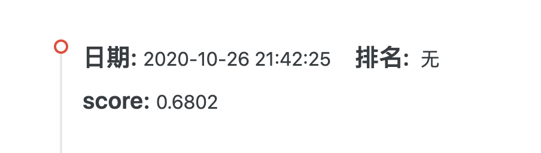

# 第五周周报

> 本次实践完整代码见[../code/competition_1_tianchi/week_5_random_forest](../code/competition_1_tianchi/week_5_random_forest)

- [第五周周报](#第五周周报)
  - [一、特征工程](#一特征工程)
  - [二、模型选择](#二模型选择)
    - [1. Random Forest 随机森林](#1-random-forest-随机森林)
      - [a. 随机森林Random Forest介绍](#a-随机森林random-forest介绍)
      - [b. `RandomForestClassifier` 参数介绍](#b-randomforestclassifier-参数介绍)
      - [c. 随机森林的使用](#c-随机森林的使用)
      - [d. 本次成绩](#d-本次成绩)

## 一、特征工程

在第二周的特征工程中，进行了**数据选择**和**缺失值处理**。详见[第二周周报](./week_report_2.md)。

在第三周的特征工程中，进行了**非数值数据转化为数值数据**。详见[第三周周报](./week_report_3.md)。

本周数据沿用第二周和第三周的特征工程处理出的数据进行训练。


## 二、模型选择

### 1. Random Forest 随机森林

上周使用了GBDT，梯度提升树——使用Boosting方法的模型。那么很容易想到用运用Bagging方法的模型再做训练。故本周尝试使用随机森林。

#### a. 随机森林Random Forest介绍

随机森林是由很多决策树构成的，不同决策树之间没有关联。

进行分类任务时，新的输入样本进入，让森林中的每一棵决策树分别进行判断和分类，每个决策树会得到一个自己的分类结果，分类结果中哪一个分类最多，那么这个结果即是最终的结果。

本次实现使用scikit-learn库的随机森林分类器 `sklearn.ensemble.RandomForestClassifier`。


#### b. `RandomForestClassifier` 参数介绍

全部参数介绍可见[官方英文文档-sklearn.ensemble.RandomForestClassifier](https://scikit-learn.org/stable/modules/generated/sklearn.ensemble.RandomForestClassifier.html#sklearn.ensemble.RandomForestClassifier)，在此介绍本次代码中自定义使用的参数（已自行翻译为中文）。

- `max_depth`：树最大深度，默认为None。如果为None，扩展节点到所有叶为纯粹的或者到所有叶包含少于 `min_samples_split` 个样本。
- `min_samples_split`：默认为2。分裂一个内部节点所需最小样本数。
- `random_state`：默认为None。控制建立树时有放回的抽取样本（Bootstrapping）的随机性，以及寻找每个节点最优分裂时特征采样的随机性。

#### c. 随机森林的使用

本次代码中使用随机森林：

```python
from sklearn.ensemble import RandomForestClassifier
clf = RandomForestClassifier(max_depth = 2, random_state = 0)
clf.fit(train_x, train_y)
result = clf.predict_proba(test_x)
```

#### d. 本次成绩



相比第四周使用GBDT的成绩0.7141有所下降。


